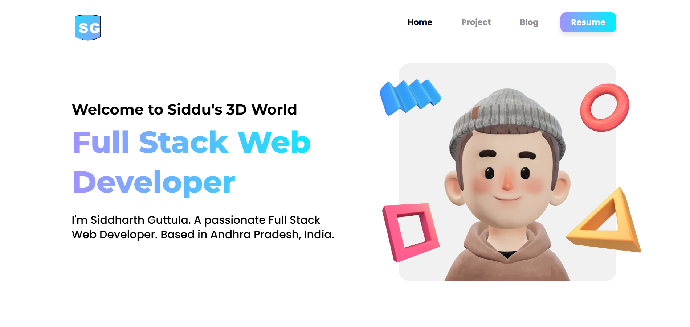

# 🌎 Siddu's 3D World – Portfolio  

[](https://github.com/Zpphs-gollavilli/Siddu-s-3D-World "Go to GitHub repo")  
[](#license)  
  
  

✨ **Siddu’s 3D World** is my interactive portfolio built with **React + Three.js + TailwindCSS**, where creativity meets 3D animations.  
It showcases my skills, projects, and hobbies in a **fun, animated 3D experience**.  

---

## 🚀 Features & Animations
- 🌌 Immersive **3D world** built with **Three.js**
- 🎭 Smooth transitions using **Framer Motion**
- 🌀 Animated models (customized character + elements)
- 📱 **Responsive design** – works on mobile & desktop
- 🎨 Modern UI with **TailwindCSS**
- 🖼️ Showcases projects, skills, and creativity

---

## 🖼️ Preview  
Here’s a sneak peek of my project 👇  

  

---

## 🛠️ Tech Stack  
- ⚛️ **React + Vite** – frontend framework  
- 🎨 **Tailwind CSS** – modern styling  
- 🌐 **Three.js & React-Three-Fiber** – 3D animations  
- ✨ **Framer Motion** – smooth transitions  

---

## 📦 Assets  
👉 Create your own 3D characters at [peeps.ui8.net](https://peeps.ui8.net/)  

---

## ⚡ How to Use
If you want to run this project locally:  

1. **Clone the repository**  
   ```bash
   git clone https://github.com/Zpphs-gollavilli/Siddu-s-3D-World.git
