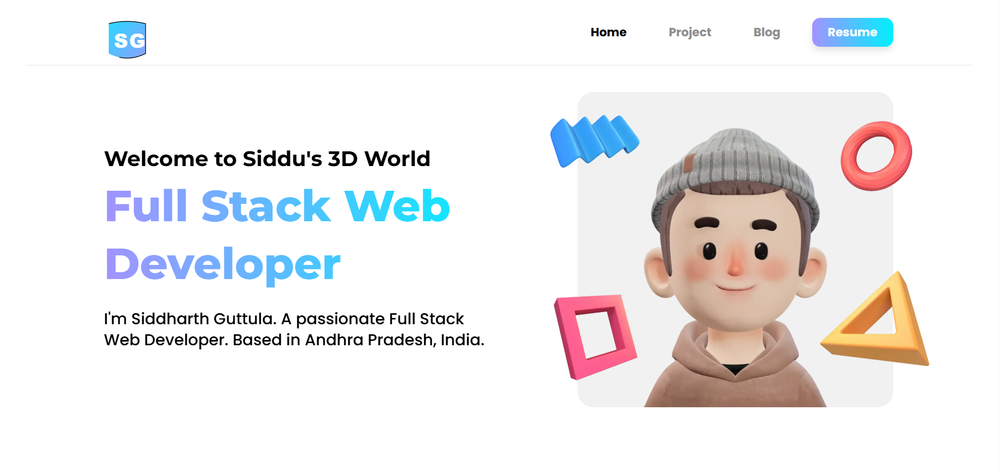

# 🌎 Siddu's 3D World – Portfolio  

[](https://github.com/Zpphs-gollavilli/Siddu-s-3D-World "Go to GitHub repo")  
[](#license)  
  
  

✨ **Siddu’s 3D World** is my interactive portfolio built with **React + Three.js + TailwindCSS**, where creativity meets 3D animations. Inspired by modern portfolio designs, but reimagined in my own style.  

---

## 🚀 Features & Animations
- 🌌 Immersive 3D world built with **Three.js**
- 🎭 Smooth transitions using **Framer Motion**
- 🌀 Animated models (customized character + elements)
- 📱 Fully responsive across devices
- 🎨 Minimal & modern UI with **TailwindCSS**
- 🖼️ Showcases my projects, skills, and creative work

---

## 🖼️ Preview  
Here’s a sneak peek of my project in action 👇  

  

---

## 🛠️ Tech Stack  
- ⚛️ **React + Vite** – frontend framework  
- 🎨 **Tailwind CSS** – modern styling  
- 🌐 **Three.js & React-Three-Fiber** – 3D animations  
- ✨ **Framer Motion** – smooth page transitions  

---

## 📦 Assets  
👉 Create your own 3D character at [peeps.ui8.net](https://peeps.ui8.net/)  

---

## 📜 License  
Released under [MIT](/LICENSE) by [@Zpphs-gollavilli](https://github.com/Zpphs-gollavilli)  

---

## 🎥 Demo GIF (Optional)  
You can also record a **GIF animation** of your portfolio using [ScreenToGif](https://www.screentogif.com/) or OBS, then add it like this:  

```md

